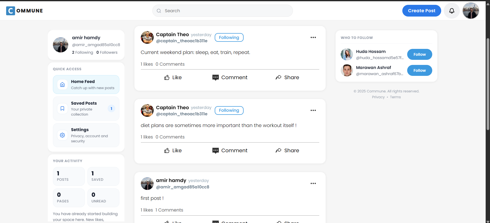
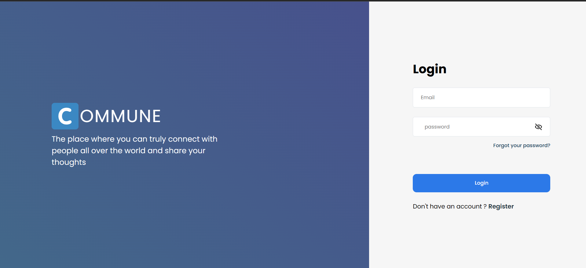
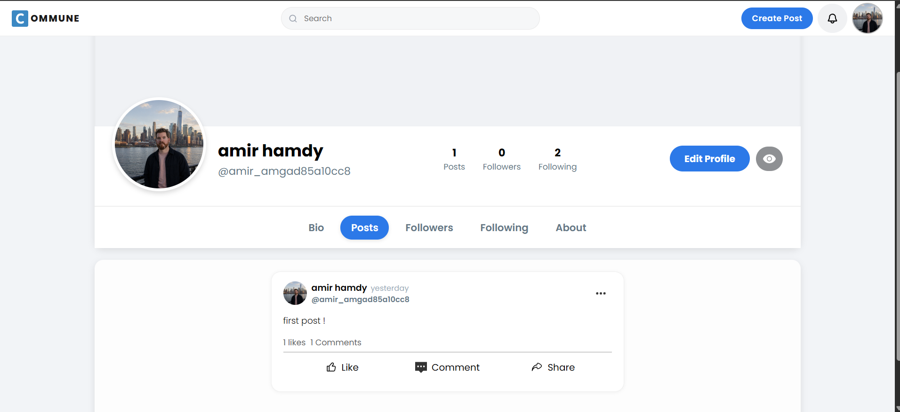
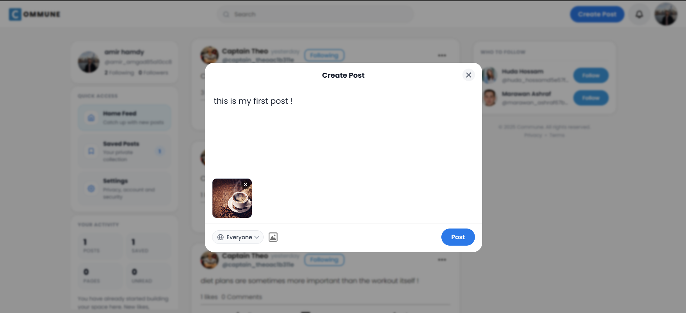

# 📱 [Commune]

> Interactive Social Media Platform It is designed around the core mechanics of a modern community product: personalized feeds, profile systems, page/org presence, media posts, moderation workflows, privacy controls, and account security. 




---

## 🔗 Demo

| Resource | Link |
|---|---|
| 📹 Video Walkthrough | [Watch on YouTube](https://www.youtube.com/watch?v=k2FarrX3Zng) |
---

##  About The Project

### 1. Personalized Feed Engine
The home feed is backed by a scoring system that ranks content using signals such as:

- Post recency
- Follow relationships
- Author affinity from prior likes
- Engagement score
- Saved-post behavior
- Seen/interacted-with exclusions

The project also includes a cache layer for feed results, which shows attention to both product relevance and performance.

### 2. Social Graph and Content System
Users can create content, interact with posts, follow other users, save posts, comment, and browse profile-driven content. Pages extend the platform beyond individuals, allowing brands, communities, or organizations to maintain their own identity and publishing surface.

### 3. Security and Access Control
Commune includes several security-focused implementation details:

- Session-backed CSRF token handling
- Token-based authentication with IP and user-agent validation
- Token renewal and expiry logic
- Encrypted IDs in sensitive flows
- Visibility-aware post access checks
- Banned-user enforcement with temporary and permanent ban handling

### 4. Admin and Moderation Tooling
The admin experience is a meaningful part of the application, not an afterthought. The dashboard supports:

- Platform overview metrics
- Verification request review
- User search and management
- Sanctions including warnings, temporary bans, and permanent bans
- Content moderation for posts and comments

This is the kind of operational tooling that turns a portfolio project into a system-level product build.
---

## ✨ Features

-  User registration and login with session-based authentication
-  User profiles with bio and profile picture upload
-  Create, edit, and delete posts
-  Like and comment on posts
-  Follow / unfollow other users
-  Personalized feed based on followed users
-  Notifications system
-  Search users and posts
-  Responsive design for mobile and desktop


---

## 🛠️ Built With

| Layer | Technology |
|---|---|
| **OS / Server** | Windows, Apache HTTP Server |
| **Backend** | PHP 8.x |
| **Database** | MySQL 8.x |
| **Frontend** | HTML5, CSS3, Vanilla JavaScript |
| **Local Dev Environment** | WAMP Server |

---

## 🗄️ Database Schema

main core tables

```
users           → stores user accounts and profile info
posts           → stores posts linked to a user (user_id FK)
likes           → junction table: user_id + post_id
comments        → linked to a post and a user
follows         → junction table: follower_id + following_id
notifications   → linked to a user, stores event type + reference
```

> See [`/Database/DB.sql`](./Database/DB.sql) for the full schema.

---

## 🚀 Getting Started

Follow these steps to run the project locally on your own machine.

### Prerequisites

- Xampp or Laragon
- PHP 8.x
- MySQL 8.x

### Installation

**1. Clone the repository**
```bash
git clone https://github.com/amirhamdy450/Commune
```

**2. Move the project to your server root**
```
# For Laragon, place it in:
C:/Laragon/www/Commune/
```

**3. Import the database**
- Open phpMyAdmin at `http://localhost/phpmyadmin`
- Create a new database, e.g. `commune_demo`
- Import the file: `Database/DB.sql`

**4. Configure the database connection**

Create Config.php in Includes/

and add your credentials:

```php
define('DB_HOST', 'localhost');
define('DB_USER', 'root');
define('DB_PASS', '');          // your  MySQL password
define('DB_NAME', 'social_app_db');
```

**5. Start WAMP and open the app**
```
http://localhost/commune/
```

---

## 📸 Screenshots

<table>
  <tr>
    <td><strong>Login Page</strong></td>
    <td><strong>Home Feed</strong></td>
  </tr>
  <tr>
    <td></td>
    <td></td>
  </tr>
  <tr>
    <td><strong>User Profile</strong></td>
    <td><strong>Post Detail</strong></td>
  </tr>
  <tr>
    <td></td>
    <td></td>
  </tr>
</table>

---

##  What I Learned


- Designing a normalized relational schema and writing complex SQL JOIN queries
- Implementing secure password hashing with `password_hash()` and `password_verify()`
- Managing user sessions and protecting routes from unauthorized access
- Structuring a PHP project without a framework (MVC-inspired architecture)
- Handling file uploads (profile pictures, post images) with server-side validation
- Writing clean, reusable PHP functions and separating concerns across files


##  Author

**Your Name**  
📧 amirhamdy450@gmail.com  
🔗 [LinkedIn](https://www.linkedin.com/in/amir-amgad-9b1636116/)  
🐙 [GitHub](https://github.com/amirhamdy450)

---

## 📄 License

This project is open source and available under the [MIT License](./LICENSE).